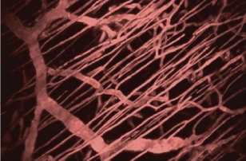
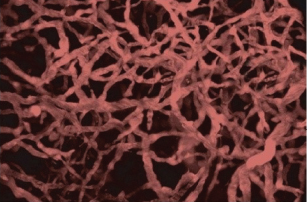
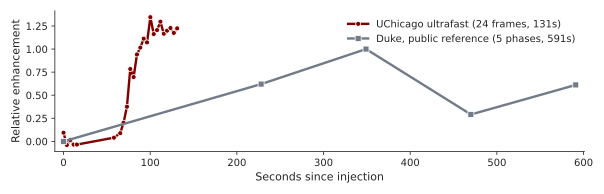
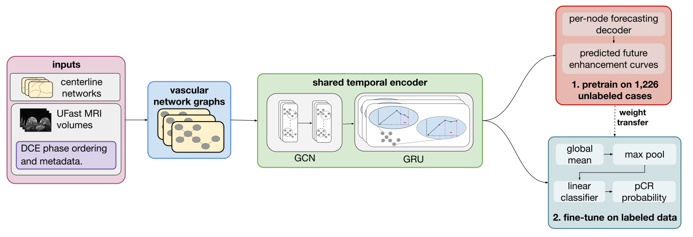
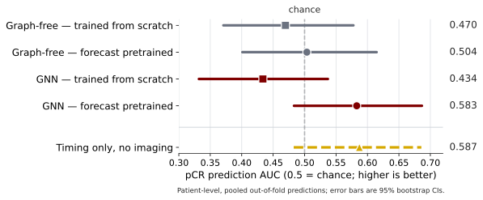

## Can vessel networks help personalize treatment?

::: {.motivation-grid}
::: {.story-card}

THE TREATMENT

Neoadjuvant therapy is given before surgery to shrink the tumor.

:::

::: {.story-card .feature-card}

THE OUTCOME

About 1 in 3 exams came from patients who achieved a pathologic complete response (**pCR**): no invasive cancer remained in the breast or nearby lymph nodes at surgery.
 <!-- Achieving pCR is associated with better long-term outcomes. -->
 

:::

::: {.story-card}

THE QUESTION

Can a GNN use connections within breast vessel networks to improve treatment-response prediction?

:::
:::

Earlier prediction could guide less intensive therapy for patients likely to achieve pCR and alternative therapy for those unlikely to do so.

::: {.notes}
Many patients with breast cancer receive neoadjuvant therapy before surgery. A
pathologic complete response, or pCR, means no invasive cancer remains at surgery;
in our dataset, about one third of exams reached that outcome, and it's associated
with better long-term outcomes. The model we built predicts pCR. Our question is
whether a GNN, a model that learns from both vessel measurements and the
connections between them, can use the structure of the breast's vessel network to
improve that prediction. This is research toward decision support. It isn't a
clinical tool or a replacement for physicians.
:::

## Tumors build a messier blood supply

::: {.image-row}
{.nostretch height="300px" fig-align="center"}

{.nostretch height="300px" fig-align="center"}
:::

::: {.result-grid}
::: {.result-card}
<strong>Normal vessels: organized, efficient.</strong>

Blood flows through a predictable, well-structured network.
:::

::: {.result-card .caution}
<strong>Tumor vessels: dense, tortuous, leaky.</strong>

Tumors stimulate abnormal vessel growth as they grow. Structure may reflect how aggressive a tumor is.
:::
:::

Because tumor vessels differ in both structure and blood flow, those patterns may help predict treatment response.

::: {.notes}
Tumors don't just sit passively. They recruit their own blood supply to keep growing, and
those new vessels tend to be dense, tortuous, and leaky rather than organized like normal
vessels. That abnormal structure, and how contrast moves through it, may reflect the
tumor's underlying biology and even affect how well drug reaches it. That's the biological
reason we expected vessel structure and dynamics to carry a treatment-response signal,
beyond just trying a fancier model.
:::

## Ultrafast MRI movie shows more than anatomy

<!-- 
After contrast is injected, repeated MRI frames reveal <strong>how it appears through the breast's vessels over time.</strong>
 -->

{.nostretch width="80%" fig-align="center"}

Curves are from different patients and are shown only to compare temporal sampling.

::: {.three-facts}

<strong>179</strong>exams with known outcomes

<strong>1,226</strong>additional exams without outcome labels, used to teach the model how contrast changes over time

<strong>13–24</strong>frames per ultrafast movie

:::

::: {.notes}
These scans are closer to a short movie than a still picture. A contrast agent
enters the blood, and the scanner repeatedly records where it appears at one
point in the vessel network, over and over. Those are two real curves, same
kind of signal, same relative-enhancement scale, from different patients: a
conventional protocol takes five snapshots spread across about ten minutes;
our ultrafast protocol takes twenty-four frames in about two minutes, so we
watch the wash-in happen instead of connecting a few dots across it. We have
179 exams with known outcomes to predict response with, plus a much larger
pool of 1,226 additional exams with no outcome label at all, which we can
still use to teach the model how contrast changes over time, without ever
touching the answer we're trying to predict.
:::

## Does the graph structure help? How about pretraining?

{.nostretch width="100%" fig-align="center"}

::: {.notes}
Reading left to right: first, we turn each patient's vessel network into a graph,
so the GNN can see which vessel locations connect to which. Second, we pretrain
the GNN by having it predict later MRI frames at those connected locations, using
about twelve hundred exams with no outcome label. Third, we take that same
pretrained GNN and train it to predict pCR on the labeled exams. I built and
trained the models in Python using PyTorch and PyTorch Geometric. We compare
this against a matched model that sees the same measurements but no vessel
connections, both from random weights and after the same pretraining, so we can
isolate what the connections and the pretraining each contribute.
:::

## Learning to predict later MRI frames improved the GNN

{.nostretch width="54%" fig-align="center"}

::: {.result-grid}
::: {.result-card}
<strong>Pretraining helped.</strong>

Learning to predict later MRI frames improved the GNN by **0.149 AUC** (95% CI, 0.046&ndash;0.255). After pretraining, the GNN also outperformed the matched graph-free model by **0.079** (95% CI, 0.010&ndash;0.155).
:::

::: {.result-card .caution}
<strong>But scan timing was associated with pCR too.</strong>

A model using only scan-timing information, no imaging, reached **AUC 0.587** (95% CI, 0.483&ndash;0.686), and its predictions correlated with the GNN's at **r = 0.50**. We don't yet know why; next we need to determine what drives that association and whether it influences the GNN's predictions.
:::
:::

::: {.notes}
Learning to predict later MRI frames gave the GNN a real, statistically meaningful
boost: about fifteen points of AUC, with a confidence interval that stays clearly
above zero. The matched graph-free model improved too, but by less, and its
interval crosses zero, so we can't be confident that helped at all. Once both
models were pretrained, the GNN beat the graph-free model by about eight points.
In other words, the vessel connections only started to matter after the model had
rehearsed the future.

But here's the catch, shown as the fifth row on this same plot. A model that sees
nothing but scan timing (frame count, duration, cadence) scores almost exactly as
well, and its predictions correlate with the pretrained GNN's at about r equals
point five. Scan timing is associated with pCR in this cohort, but we don't yet
know why. Next, we need to determine what drives that association and whether it
influences the GNN's predictions.
:::

## What should you remember?

::: {.remember-grid}
::: {.remember-card}
1

Learning to predict later MRI frames improved the <strong>GNN</strong>, which then outperformed the matched graph-free model.

:::

::: {.remember-card}
2

Enhancement measurements without vessel connections <strong>remained near chance.</strong>

:::

::: {.remember-card}
3

How the scans were timed also predicted pCR, so we need to learn whether the model is detecting <strong>tumor biology or scan differences.</strong>

:::
:::

Learning to predict contrast changes improved the GNN, but some of its signal may come from how the scans were collected.

::: {.notes}
Three things to take away. Learning to predict later MRI frames improved the GNN,
and once pretrained it outperformed the matched graph-free model. On its own,
enhancement measurements without vessel connections remained near chance. And how
the scans were timed also predicted pCR in this cohort, so our next step is
learning whether the GNN is detecting tumor biology or differences in how the
scans were collected. Learning to predict contrast changes improved the GNN, but
some of its signal may come from how the scans were collected.
:::

## Thank you

Questions welcome.

::: {.three-facts}

<strong>Code</strong>github.com/dsi-clinic/vanguard

<strong>Contact</strong>svenancio@wisc.edu

:::

Thanks to Zhen Ren, Milica Medved, and Greg Karczmar for feedback and MRI-physics expertise; Fred Howard for the development cohort; and Bella Summe, Julia Luo, José Cardona Arias, and Rebecca Wu for earlier vessel-pipeline development.

::: {.notes}
Thank you. Happy to take questions now, or find me afterward, my contact and the
code are both up here. I also want to thank the people who made this possible:
Zhen Ren, Milica Medved, and Greg Karczmar for feedback and MRI-physics expertise,
Fred Howard for the development cohort, and Bella Summe, Julia Luo, José Cardona
Arias, and Rebecca Wu for earlier vessel-pipeline work this builds on.
:::
