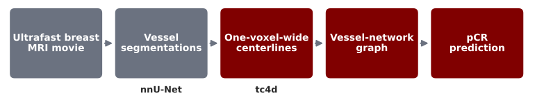

## Before surgery, chemotherapy is a high-stakes test

::: {.motivation-grid}
::: {.story-card}

THE TREATMENT

Before surgery

Chemotherapy can shrink a tumor and reveal how it responds.

:::

::: {.story-card .feature-card}

THE OUTCOME

≈ 1 in 3

scans came from patients with no remaining invasive cancer at surgery.

:::

::: {.story-card}

THE QUESTION

Can MRI help?

Could an existing scan give us an earlier clue about treatment response?

:::
:::

The long-term goal is better evidence for tailoring treatment, not replacing clinical judgment.

::: {.notes}
Many patients with breast cancer receive chemotherapy before surgery. A pathologic
complete response means no invasive cancer remains at surgery; in our dataset,
about one third of patients achieved a complete response. Chemotherapy is demanding,
so the motivation is simple: can information already present in an MRI give us an
earlier clue? This is research toward decision support, not a clinical tool or a
replacement for physicians.
:::

## Tumors build a messier blood supply

New vessels don't look or behave like normal ones.

::: {.motivation-grid}
::: {.story-card}

NORMAL VESSELS

Organized, efficient

Blood flows through a predictable, well-structured network.

:::

::: {.story-card .feature-card}

TUMOR VESSELS

Dense, tortuous, leaky

Structure may reflect how aggressive a tumor is.

:::

::: {.story-card}

OUR IDEA

Read the vessels

If that structure tracks tumor biology, it might help predict response.

:::
:::

That's the biological reason to expect a vessel-based signal, not just a modeling choice.

::: {.notes}
Tumors don't just sit passively. They recruit their own blood supply to keep growing, and
those new vessels tend to be dense, tortuous, and leaky rather than organized like normal
vessels. That abnormal structure, and how contrast moves through it, may reflect the
tumor's underlying biology and even affect how well drug reaches it. That's the biological
reason we expected vessel structure and dynamics to carry a treatment-response signal,
beyond just trying a fancier model.
:::

## An MRI "movie" shows more than anatomy

After contrast is injected, repeated MRI frames reveal <strong>how it appears through the breast's vessels over time.</strong>

{.nostretch width="90%" fig-align="center"}

::: {.three-facts}

<strong>179</strong>analyzed exams

<strong>141</strong>patients

<strong>13–24</strong>frames per MRI movie

:::

::: {.notes}
These scans are closer to a short movie than a still picture. A contrast agent
enters the blood, and the scanner repeatedly records where it appears. We isolate
the vessels, reduce them to centerlines, and turn the branching structure into data
a model can read. The study included 179 exams from 141 patients, with 13 to 24
frames per movie. That gives us both vessel shape and change over time.
:::

## Two ingredients, one controlled comparison

Does <strong>connecting the vessel map</strong> help? Does <strong>rehearsing the future</strong> help?

{.nostretch width="58%" fig-align="center"}

Encoder pretrained on 1,226 unlabeled exams, then fine-tuned with and without connections, from pretrained or random weights.

::: {.notes}
We ran a controlled two-by-two comparison. One factor is the model itself: a graph
neural network where each vessel location shares information with its connected
neighbors, versus a simple model that only sees the same measurements, with no
connections. The other factor is how each model starts: from random weights, or
pretrained by first learning to predict future vessel brightness at connected
locations, using about twelve hundred unlabeled exams, then fine-tuned on the
labeled data. Everything else (inputs, training, and patient-grouped folds) stays
identical across all four combinations.
:::

## Pretraining gave the graph model a real boost

{.nostretch width="62%" fig-align="center"}

The boost was real: <strong>+0.149 [+0.046, +0.255]</strong> AUC for the GNN, a gain graph-free didn't reliably show. Pretrained, GNN then beat graph-free by <strong>+0.079 [+0.010, +0.155]</strong>.

::: {.notes}
Pretraining gave the graph model a real, statistically meaningful boost: about fifteen
points of AUC, with a confidence interval that stays clearly above zero. The simple
summary model improved too, but by less, and its interval crosses zero, so we can't be
confident that helped at all. Once both models were pretrained, the graph model beat
the simple summary by about eight points. In other words, the vessel connections only
started to matter after the model had rehearsed the future.
:::

## But the clock may be part of the story

::: {.result-grid}
::: {.result-card .caution}
<strong>Timing alone scores nearly as well.</strong>

A model using only frame count, scan duration, and cadence (no imaging at all) reaches 0.587 AUC, almost identical to the pretrained graph model's 0.583.
:::

::: {.result-card .caution}
<strong>The two track each other.</strong>

Their predictions correlate (Pearson r = 0.50), so acquisition timing is associated with outcome in this cohort.
:::
:::

This raises concern about protocol dependence, but doesn't tell us how much of the signal is technical versus biological. Adjustment could also remove real patient differences.

::: {.notes}
Here's the catch. A model that sees nothing but scan timing (frame count, duration,
cadence) scores almost exactly as well as our pretrained graph model, and their
predictions correlate at about r equals point five. That's a real concern: some of
what looks like a vessel signal could instead be tracking which protocol a patient
happened to get. But it doesn't prove that. Adjusting for timing could just as easily
strip out genuine biological differences that happen to correlate with acquisition.
Separating the two is exactly what we test next.
:::

## What should you remember?

::: {.remember-grid}
::: {.remember-card}
1

Forecast pretraining gave the <strong>graph model a real boost</strong>, which then beat the matched simple-summary model.

:::

::: {.remember-card}
2

Vessel enhancement still carries only <strong>modest, uncertain</strong> signal on its own.

:::

::: {.remember-card}
3

Acquisition timing tracks outcome too. Next, we <strong>separate protocol from biology.</strong>

:::
:::

Teaching the model to anticipate the future made the vessel map matter, but timing still complicates the story.

::: {.notes}
Three things to take away. Forecast pretraining gave the graph model a real, meaningful
boost, and once pretrained it beat the matched model that ignores vessel connections.
On its own, vessel enhancement still carries only modest and uncertain signal. And
acquisition timing is also linked to outcome in this cohort, so our next step is
testing whether the vessel signal survives once we account for that. Teaching the
model to anticipate the future made the vessel map matter, but timing still
complicates the story.
:::
